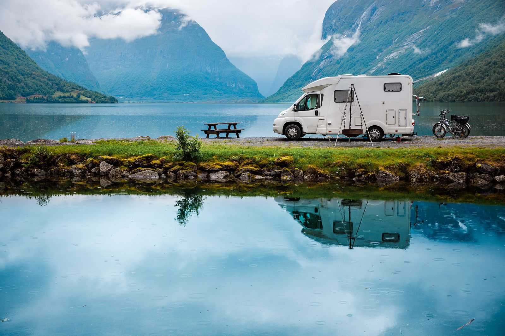

# Campers in Ukraine

Campers in Ukraine is a user-friendly website designed to help users explore and book available campers for rent across Ukraine. With this platform, users can easily browse through a variety of camper options, add favorites, and utilize advanced filtering options based on equipment, location, and type of van.

## Features

### 1. Browse Available Campers

- Users can explore a wide range of campers available for rent in Ukraine.
- Each camper listing provides detailed information including photos, amenities, and rental specifications.

### 2. Favorite Functionality

- Users can add campers to their favorites list for easy access and comparison.
- Favorite campers can be viewed and managed from the user's profile.

### 3. Advanced Filtering

- The platform offers advanced filtering options to help users find the perfect camper.
- Filters include equipment (e.g., kitchen facilities, sleeping capacity), location, and type of van (e.g., fully integrated, camper van, alcove).

# Technologies used:

Frontend:

- Vite,
- HTML/CSS,
- JS,
- Axios,
- React,
- Styled-components,
- Redux,
- ReduxToolkit,
- Redux-persist

Backend:

- MockAPI.
